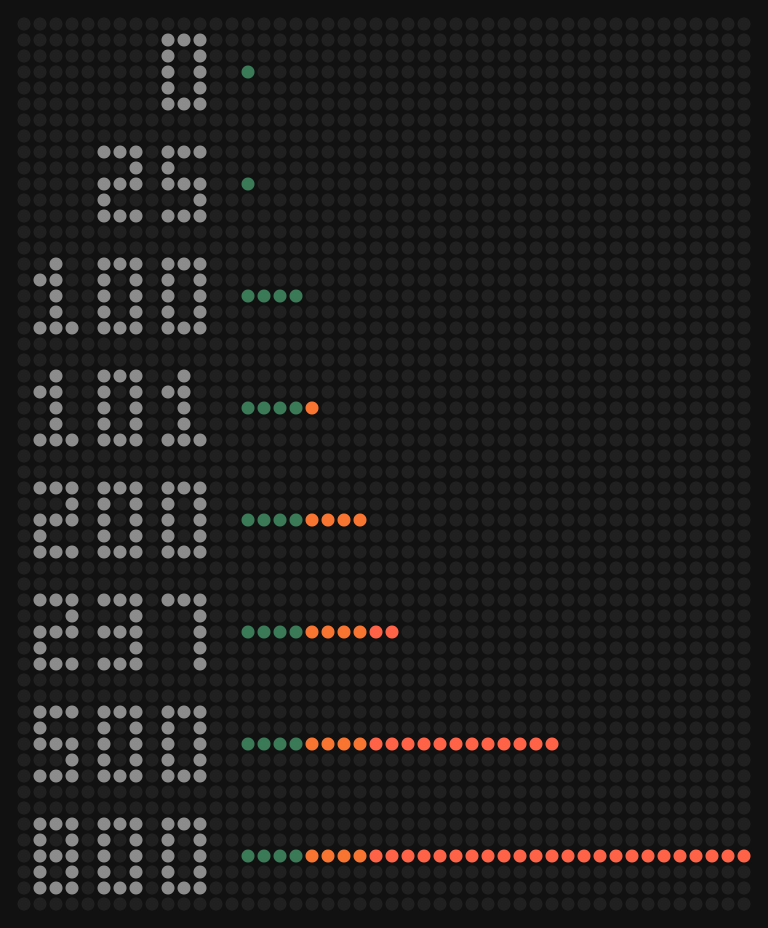

# awtrix-ng-clock

Clock script for AWTRIX NG. Shows the time, outdoor temperature, a small weather icon and a bar for the current electricity price along the bottom row.


It runs as a Berry script on the clock itself. The time comes from the clock's own NTP sync, so it keeps going even if Home Assistant is down. Temperature, weather and price come in over MQTT.

## Layout

- Time on the left
- Outdoor temperature, right aligned next to the icon
- 3 pixel wide weather icon on the right edge
- Price bar on the bottom row

## Price bar

One pixel for every started 25 öre/kWh, growing from the left.

| Pixel | Price | Colour |
|---|---|---|
| 1-4 | up to 100 öre | green |
| 5-8 | 100-200 öre | orange |
| 9-32 | over 200 öre | red |

0 öre or below still lights one green pixel. 800 öre or more fills the whole row. If the payload isn't a number the bar is left blank.

Some examples:

```
 36 öre  GG
101 öre  GGGGO
237 öre  GGGGOOOORR
```

Colours can be changed in the script settings.



## Examples

The photo at the top is a dump of the real panel. These are rendered from the same drawing code and the AWTRIX NG font, so they match what the clock shows pixel for pixel.

| | |
|---|---|
|  | 18 öre, sunny |
|  | 95 öre, thunder |
|  | 162 öre, rain |
|  | 287 öre, snow |
|  | 640 öre, cloudy |

## Weather icons


From left: sunny, clear-night, cloudy, partlycloudy, rainy, pouring, snowy, snowy-rainy (also hail), fog, lightning (also lightning-rainy and exceptional), windy (also windy-variant), and the dot for anything else.

## What you need

- AWTRIX NG with scripting enabled (I run 1.1.0)
- An MQTT broker the clock is connected to
- Something that publishes the data. I use Home Assistant for the weather and Node-RED for the price, both are in this repo.
- A price sensor in öre/kWh. I use [ha-elprisetjustnu](https://github.com/TSA3000/ha-elprisetjustnu) for SE3, VAT included.

## Install

Open the AWTRIX web UI, go to Scripts, create a script called `ClockTemp`, paste in `clocktemp.be` and save.

Or from a terminal:

```
curl -X PUT http://<awtrix-ip>/api/v1/apps/script/ClockTemp \
  -H "Content-Type: text/plain" --data-binary @clocktemp.be
```

Then set up the feeds below.

## MQTT topics

| Topic | Payload | Example |
|---|---|---|
| `awtrix/outdoor/temp` | temperature, rounded | `15` |
| `awtrix/outdoor/cond` | Home Assistant weather state | `partlycloudy` |
| `awtrix/elpris` | price in öre/kWh | `35.82` |

Publish them retained so the clock has values straight after a reboot. The topic names can be changed in the script settings.

Weather states it knows: sunny, clear-night, cloudy, partlycloudy, rainy, pouring, snowy, snowy-rainy, hail, fog, lightning, lightning-rainy, exceptional, windy, windy-variant. Anything else shows a grey dot.

## Feeding the data

### Home Assistant

- `homeassistant/weather_to_mqtt.yaml` sends temperature and weather. Change `weather.home` to your weather entity.
- `homeassistant/price_to_mqtt.yaml` sends the price, if you'd rather not use Node-RED.

Create a new automation, switch to YAML mode and paste the file in.

### Node-RED

Import `node-red/price_to_mqtt.json`, open both nodes, pick your Home Assistant server and MQTT broker, and deploy.

If the MQTT node sits on "connecting", check the broker login. The Mosquitto add-on in Home Assistant won't accept clients without a username and password.

## Notes

- The price sensor I use updates a couple of minutes after each quarter hour, so the bar can be slightly behind.
- At -10 degrees and colder the temperature is three characters wide and sits right up against the clock with no gap, so `08:00` and `-12` read as `08:00-12`.
- The text uses rows 1-5 and the icon rows 2-6. If you want them lined up, subtract 1 from every y in `draw_icon()`.
- Everything is worked out when a message arrives. `draw()` runs about 40 times a second and doesn't allocate anything.
